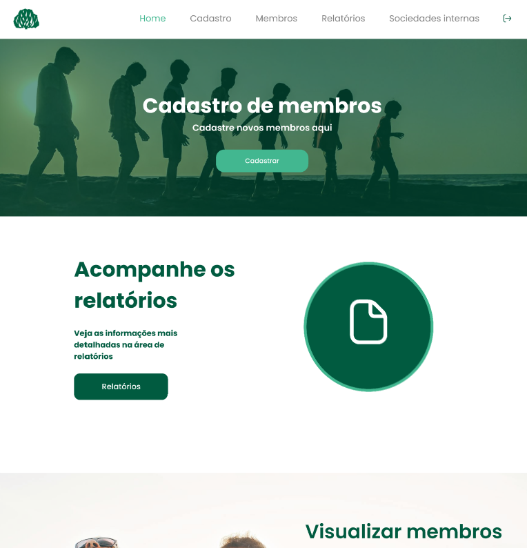

<a name="readme-top"></a>


<h3 align="center">Projeto Software IPJ</h3>




<!-- ABOUT THE PROJECT -->
## Sobre o Projeto

Esse projeto está sendo realizado para a Igreja Presbiteriana de Joinville, com o fim principal de controle de membros da igreja.


### Contruído com:


    
    


<!-- GETTING STARTED -->
## Começando

Primeiro passo é a clonagem de repositório.Abra o Visual Code, e em seu terminal coloque o seguinte comando:

  ```sh
  git clone https://github.com/kalebefukuda/SoftwareIPJ.git .
  ```

❗️ATENÇÃO❗️

É necessário ter instalado o Git em sua máquina.

### Pacotes

Para uma instalação completa dos pacotes usados no projeto use o comando:

  ```sh
  npm install --force
  ```

<!-- USAGE EXAMPLES -->
## Para usar
Para rodar iniciar o projeto, execute o comando:


  ```sh
  npm start
  ```

<!-- LICENSE -->
## Licença

Esse projeto está sob a licença MIT.

